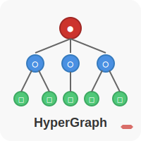

# HyperGraph

<p align="center">
  
</p>

[](https://www.ruby-lang.org/)
[](https://unlicense.org/)
[](https://github.com/isene/hypergraph/stargazers)
[](https://isene.org)

Graphing HyperLists - A powerful tool for visualizing hierarchical and process-oriented data structures.

## Overview

HyperGraph creates graphical representations of HyperLists. A HyperList can describe anything – any state or any transition - from todo lists and organizational structures to business processes and complex logic structures. It represents data in tree-structure lists with a very rich set of features.

Version 2.0 brings a complete rewrite with modular architecture, enhanced features, and improved usability.

## Features

### Core Capabilities
- **State diagrams** - Hierarchical representation (like mind maps)
- **Transition diagrams** - Sequential flow representation (like flow charts)
- **Full HyperList support** - Qualifiers, operators, references, tags, and properties
- **Multiple output formats** - PNG, JPG, SVG, PDF, HTML
- **Syntax validation** - Check HyperList syntax without generating graphs
- **Visual themes** - Professional, tech, pastel, and default themes

### New in Version 2.0
- ✨ **Modular architecture** - Clean separation of parsing and generation
- 🎨 **Theme support** - Multiple built-in visual themes
- ✅ **Validation mode** - Syntax checking with detailed error messages
- 📁 **Configuration files** - Save preferences in ~/.hypergraphrc
- 👀 **Watch mode** - Auto-regenerate on file changes
- 🎯 **Better qualifiers** - Correctly displays quantities like `[4] Wheels`
- 🔍 **Enhanced error handling** - Line numbers and helpful suggestions
- 💻 **Interactive mode** - Enter HyperList via stdin

## Installation

### Requirements
- Ruby (2.0 or higher)
- Graphviz (`apt-get install graphviz` or `brew install graphviz`)
- Optional: `gem install listen` for watch mode

### Quick Start
```bash
# Clone the repository
git clone https://github.com/isene/hypergraph.git
cd hypergraph

# Make executable
chmod +x hypergraph

# Test installation
./hypergraph -h
```

## Usage

### Basic Commands

```bash
# Generate a state diagram (hierarchical)
hypergraph -s todo.hl

# Generate a transition diagram (flow)
hypergraph -t process.hl

# Validate HyperList syntax
hypergraph --validate mylist.hl

# Use a visual theme
hypergraph --theme business -f svg report.hl

# Watch file for changes
hypergraph -w project.hl
```

### Options

#### HyperList Type
- `-s, --state` - Treat as hierarchical state diagram
- `-t, --trans` - Treat as sequential transition diagram

#### Chart Direction
- `-d, --down` - Top-to-bottom (default)
- `-u, --up` - Bottom-to-top
- `-l, --left` - Left-to-right
- `-r, --right` - Right-to-left

#### Visual Options
- `-T, --theme THEME` - Apply theme: default, business, tech, pastel
- `-e, --sep VALUE` - Set node/rank separation
- `-a, --arrow` - Use directional arrows (default)
- `-n, --noarrow` - Use non-directional lines
- `-o, --ortho` - Use angled lines
- `-p, --poly` - Use straight lines

#### Output Options
- `-f, --format FORMAT` - Output format: png, jpg, svg, pdf, html
- `-O, --output FILE` - Specify output filename
- `-W, --overwrite` - Overwrite existing files

#### Processing Options
- `-V, --validate` - Validate syntax only
- `-c, --clean` - Output clean/strict HyperList only
- `-w, --watch` - Watch mode (requires 'listen' gem)
- `-i, --interactive` - Enter HyperList interactively

#### Other Options
- `-b, --verbose` - Verbose output
- `-S, --save-config` - Save current options as defaults
- `-h, --help` - Show help
- `-v, --version` - Show version

## Examples

### Todo List with Colors
```hyperlist
Project Website (color=blue) (fillcolor=lightblue)
	[_] Planning
		[x] Requirements gathering
		[_] Design mockups #design
	[_] Development
		[_] Frontend #html #css
		[_] Backend #api
	[_] Testing
```

### Process Flow
```hyperlist
Customer Support
	Receive inquiry
	[Email] Log via email
	[Phone] Log with urgency
	Categorize
		OR:
			Technical support
			Billing inquiry
			General question
	Resolve issue
	Close ticket
```

### State Diagram
```hyperlist
Car
	Exterior
		Paint
		Windows
		[4] Wheels
	Interior
		Seats
			[2] Front
			[3] Back
	Engine
		[6] Cylinders
		Transmission
```

## Color Support

Add colors using Graphviz color names in parentheses:
```hyperlist
Important item (color=red) (fillcolor=yellow) (fontcolor=black)
```

All [Graphviz colors](https://graphviz.org/doc/info/colors.html#x11) are supported.

## Configuration

Save your preferred settings:
```bash
hypergraph --theme tech -f svg --save-config
```

Settings are stored in `~/.hypergraphrc` and automatically loaded.

## HyperList Resources

- **HyperList Definition**: http://isene.me/hyperlist/
- **Online HyperGraph**: https://isene.com/hypergraph.html
- **VIM Plugin**: For editing HyperLists in VIM

## Architecture

```
hypergraph/
├── hypergraph              # Main executable
├── lib/
│   └── hypergraph/
│       ├── parser.rb       # HyperList syntax parser
│       └── graph_generator.rb  # DOT/Graphviz generator
└── examples/               # Example HyperLists
```

## Changelog

### Version 2.0.0 (2025)
- Complete rewrite with modular architecture
- Added theme support with 4 built-in themes
- Added validation mode with detailed error reporting
- Added configuration file support
- Fixed qualifier display (now shows `[4] Wheels` correctly)
- Added watch mode for live preview
- Improved error messages with line numbers
- Added interactive input mode
- Better handling of operators (OR, AND)
- Enhanced reference support

### Version 1.x (2014-2024)
- Original implementation by Geir Isene
- Basic state and transition diagrams
- Color support
- Multiple output formats

## Contributing

The modular architecture makes contributions easy:

1. **Parser improvements**: `lib/hypergraph/parser.rb`
2. **Visual enhancements**: `lib/hypergraph/graph_generator.rb`
3. **New themes**: Add to `load_themes` method
4. **CLI features**: Main `hypergraph` file

## License

GPL v3 - Copyright 2014-2025, Geir Isene

## Author

**Geir Isene**  
g@isene.com  
http://isene.com

## See Also

- [HyperList VIM plugin](https://github.com/isene/hyperlist.vim)
- [HyperList definition](http://isene.me/hyperlist/)
- [Online HyperGraph tool](https://isene.com/hypergraph.html)
